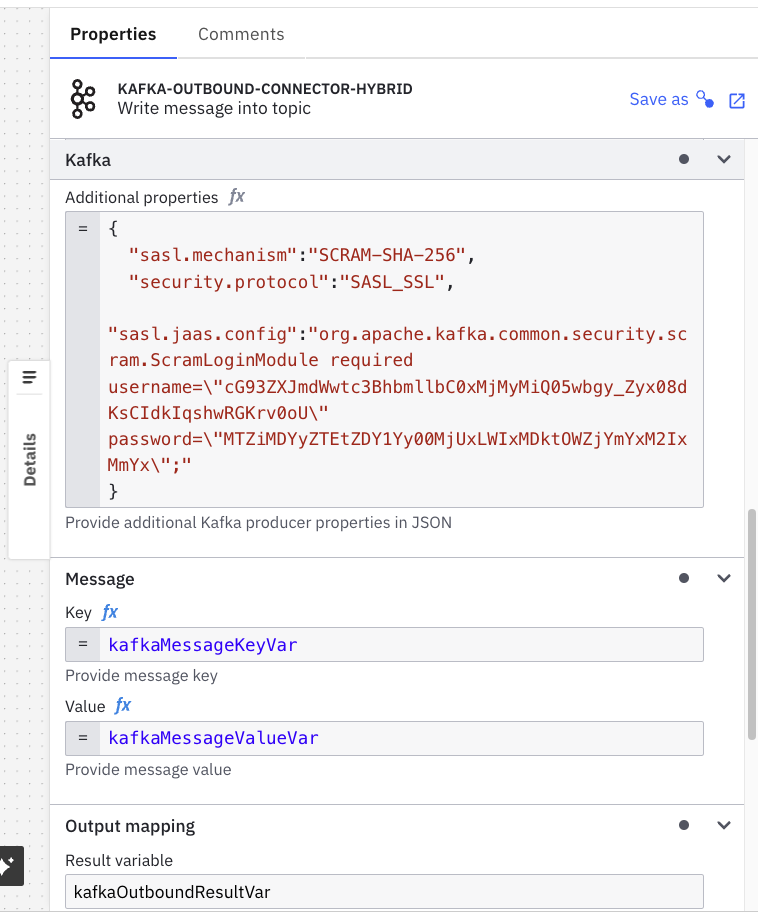
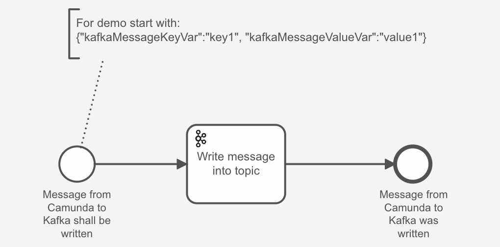
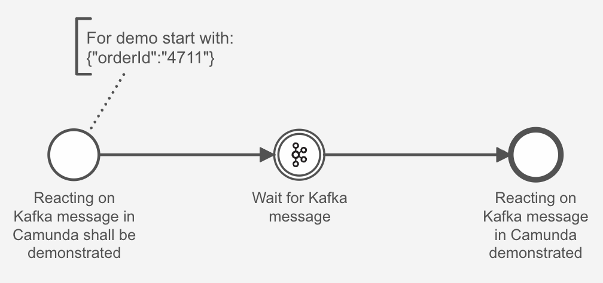

# Integration example

## Camunda <-> Kafka

The project contains an example integration between Camunda SaaS and Kafka. It makes use of  [Camundas Outbound Kafka Connector (Kafka Producer Connector)](https://docs.camunda.io/docs/next/components/connectors/out-of-the-box-connectors/kafka/?kafka=outbound) as well as  [Camundas Inbound Connector (Kafka Consumer Connector)](https://docs.camunda.io/docs/next/components/connectors/out-of-the-box-connectors/kafka/?kafka=inbound) capabilites. The connectors execution is happening via [Camundas connectors runtime in hybrid mode](https://docs.camunda.io/docs/next/guides/use-connectors-in-hybrid-mode/).  This mode can be helpful when the Kafka instance is isolated within a private network and must never be exposed to the public internet.

### Hints

Credential configuration in this repo used for Camunda SaaS as well as for Upstash Kafka is anonymized and not working. Values are configured to show exactly where to put and how to format parameters (i.e. in the header of the Kafka producer properties JSON). Please create and replace credential values as described in the following steps.

### 1. Prerequesites (steps before actual demo)

- [Camunda SaaS account](https://signup.camunda.com/accounts/)
- [Import/Upload](https://docs.camunda.io/docs/next/components/modeler/web-modeler/import-diagram/) the 2 process models in the folder [process models](./process%20models)
- Deploy custom template in the folder [connector templates](./connector%20templates/)
- Apply template on the task "_Write message into topic_"
- [Upstash Kafka account](https://upstash.com/) (its free :) )
    1. create Kafka instance
    2. download "upstash-kafka.config" file and replace it in the root of this project 
- Via [Kafka CLI](https://docs.confluent.io/kafka/operations-tools/kafka-tools.html)
    1. create topic "integration_topic" via 
    ```
    ./kafka-topics.sh --command-config ./upstash-kafka.config --bootstrap-server powerful-spaniel-12322-eu2-kafka.upstash.io:9092 --topic integration_topic --create
    ```
- Adjust Authorization related Kafka parameters in the connector details in Camunda SaaS 
    1. Select the task "_Write message into topic_" as well as the event "_Wait for Kafka message_" and adjust the "Additional properties" JSON in the "Kafka" section of both connectors




- [Create the following secrets](https://docs.camunda.io/docs/next/components/console/manage-clusters/manage-secrets/) in the Camunda SaaS cluster. They are referenced in the connector configuration of both connector templates
    - KAFKA-USERNAME
    - KAFKA-PASSWORD

- Deploy both process models

- Start connector runtime locally, point it to Camunda SaaS and make sure to override the Kafka Producer type with the one set in the custom template

```
docker run --rm --name=HybridConnectorRuntime \
    -e ZEEBE_CLIENT_SECURITY_PLAINTEXT=false \
    -e ZEEBE_CLIENT_CLOUD_CLUSTER-ID='e05d4eea-77f3-4caa-8f2f-af6ef052fc89' \
    -e ZEEBE_CLIENT_CLOUD_CLIENT-ID='S64XuWV-CkpKL.-H3WSmCv4P5nddt_nb' \
    -e ZEEBE_CLIENT_CLOUD_CLIENT-SECRET='0GF-r9lovNYJlu9ARa3H6R.0.wMo1hP0Hac9IRboeYYI3Y3CV9ToxW-hIANCPXs3' \
    -e ZEEBE_CLIENT_CLOUD_REGION='lhr-1' \
    -e CAMUNDA_OPERATE_CLIENT_URL='https://lhr-1.operate.camunda.io/e05d4eea-77f3-4caa-8f2f-af6ef052fc89' \
    -e CONNECTOR_KAFKA_PRODUCER_TYPE='io.camunda.connectors.KAFKA.v1-hybrid' \
    -e CAMUNDA_CONNECTOR_SECRETPROVIDER_CONSOLE_ENABLED=true \
        camunda/connectors-bundle:8.5.2
```


### 2. Demo flow Outbound Connector



- Run instance with Payload as specified in the process model
- Check either with Upstash GUI or Offset Explorer or via CLI for the message from Camunda to be written

```
./kafka-console-consumer.sh --producer.config ./upstash-kafka.config --bootstrap-server powerful-spaniel-12322-eu2-kafka.upstash.io:9092 --topic integration_topic --from-beginning
```


### 3. Demo flow Inbound Connector



- Start an instance of the process

- Publish a message to topic "integration_topic"

```
./kafka-console-producer.sh --producer.config ./upstash-kafka.config --bootstrap-server powerful-spaniel-12322-eu2-kafka.upstash.io:9092 --topic integration_topic

```

- Check in the process instance history in Camunda that the workflow continued and the message payload is there

------

#### To Dos:

- Document how to use local Kafka instance in the [docker compose file](./docker-compose.yaml) as a fallback alternative to the Upstash cloud instance and adjust local Kafka commands


#### Useful tools

- [Offset Explorer](https://www.kafkatool.com/) (formerly Kafka Tool) 
    - for exploring local Kafka instance
        - On Mac available via Homebrew: brew install offset-explorer